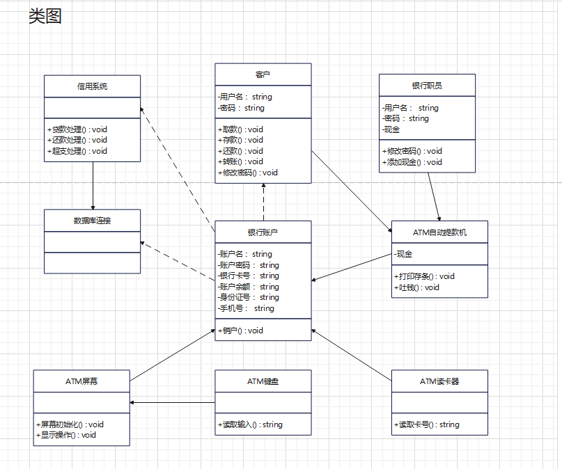
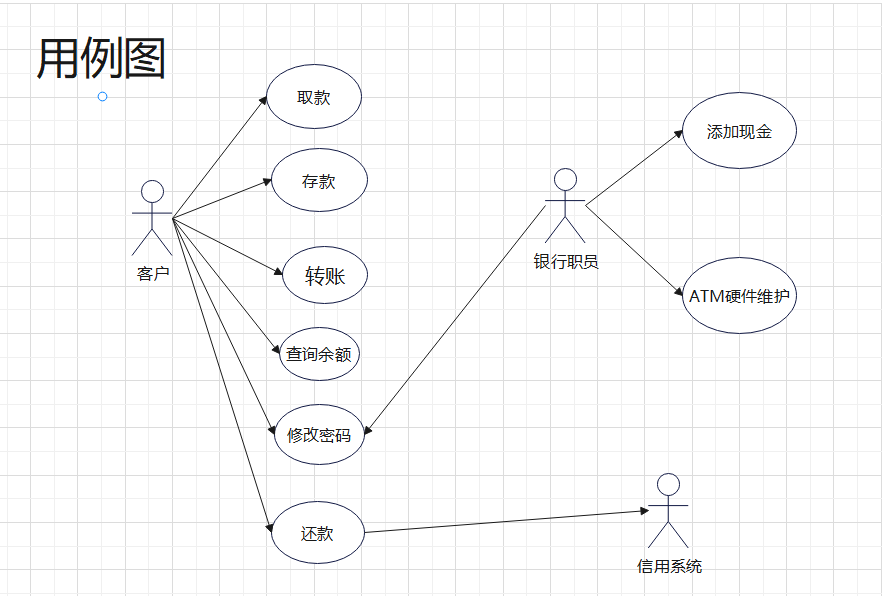

<table>
   <tr>
        <td colspan="2">软件工程导论课程作业</td>    
   </tr>
   <tr>
        <td>作业名称</td> 
        <td>ATM 自动取款机-UML图示</td> 
   </tr>
    <tr>
        <td rowspan="3">成员（按姓氏字母排序）</td>    
        <td >陈宁浩</td>  
    </tr>
    <tr>
        <td >杨子逸(版本管理)</td>  
    </tr>
    <tr>
        <td >姚瑶</td>  
    </tr>
</table>
## 一、结构类

### 1、类图

类图是描述系统中的类，以及各个类之间的关系的静态视图。能够让我们在正确编写代码以前对系统有一个全面的认识。类图是一种模型类型，确切的说，是一种静态模型类型。

根据主要的九个类对象：ATM自动提款机、客户、银行职员、信用系统、数据库连接、银行账户、ATM屏幕、ATM键盘和ATM读卡器，以及对应功能组件绘制出类图：

### 2、对象图

 与类图极为相似，它是类图的实例，对象图显示类的多个对象实例，而不是实际的类。它描述的不是类之间的关系，而是对象之间的关系。

根据类图画出一个简单的对象图：

### 3、组件图

 描述代码构件的物理结构以及各种构建之间的依赖关系。用来建模软件的组件及其相互之间的关系，这些图由构件标记符和构件之间的关系构成。在组件图中，构件时软件单个组成部分，它可以是一个文件，产品、可执行文件和脚本等。

根据类图的九个主要类对象绘制出对应组件图：

### 4、配置图

是用来建模系统的物理部署。例如计算机和设备，以及它们之间是如何连接的。部署图的使用者是开发人员、系统集成人员和测试人员。

ATM 自动取款机中的配置图描述系统节点上运行资源的安排，包括银行数据库服务器，地区ATM服务器，若干个ATM客户机(ATM客户端)，打印机。其中ATM客户机的可执行文件可运行在多个地点的不同ATM上，ATM客户机与地区ATM服务器进行通信，地区ATM服务器与银行数据库服务器进行通信，打印机与地区ATM服务器连接。

## 二、行为类

### 1、用例图

描述角色以及角色与用例之间的连接关系。说明的是谁要使用系统，以及他们使用该系统可以做些什么。一个用例图包含了多个模型元素，如系统、参与者和用例，并且显示了这些元素之间的各种关系，如泛化、关联和依赖。

客户在ATM 自动取款机中可以进行取款、存款、查询余额、转账、修改密码和还款等操作 ，其中还款涉及信用系统；银行职员在本系统中能够进行添加现金、修改密码、ATM硬件维护等操作。根据分析功能绘制出对应用例图：

### 2、序列图

序列图是用来显示你的参与者如何以一系列顺序的步骤与系统的对象交互的模型。顺序图可以用来展示对象之间是如何进行交互的。顺序图将显示的重点放在消息序列上，即强调消息是如何在对象之间被发送和接收的。

客户取款步骤大致可分为（1）客户插入银行卡 （2）ATM读卡器读取卡号 （3）ATM屏幕初始化 （4）ATM读卡器打开账户并提示输入密码（5）用户输入密码 （6）验证密码 （7）ATM屏幕提示选择操作 （8）用户选择取款操作 （9）银行账户扣除钱款更新数据库（10）吐钱机提供钱和收据 （11）用户取钱并退卡

根据大致的步骤绘制出客户取款对应序列图如下：

### 3、行为图

描述用例要求所要进行的活动，以及活动间的约束关系，有利于识别并行活动。能够演示出系统中哪些地方存在功能，以及这些功能和系统中其他组件的功能如何共同满足前面使用用例图建模的商务需求。

在ATM 自动取款机中描述参与者，即银行职员、信用系统、客户如何相互协同工作，下面给出用于描述客户创建新账号的行为图：

### 4、协作图

和序列图相似，显示对象间的动态合作关系。可以看成是类图和顺序图的交集，协作图建模对象或者角色，以及它们彼此之间是如何通信的。如果强调时间和顺序，则使用序列图；如果强调上下级关系，则选择协作图；这两种图合称为交互图。

根据序列图作出协作图：

### 5、状态图

描述类的对象所有可能的状态，以及事件发生时状态的转移条件。可以捕获对象、子系统和系统的生命周期。他们可以告知一个对象可以拥有的状态，并且事件(如消息的接收、时间的流逝、错误、条件变为真等)会怎么随着时间的推移来影响这些状态。一个状态图应该连接到所有具有清晰的可标识状态和复杂行为的类；该图可以确定类的行为，以及该行为如何根据当前的状态变化，也可以展示哪些事件将会改变类的对象的状态。状态图是对类图的补充。

描述用户存取款的状态图：

